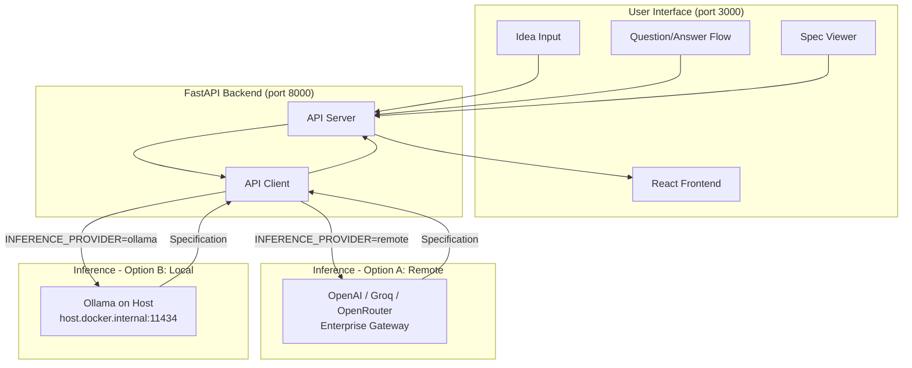

# SpecForge — AI-Powered System Design Spec Generator

An AI-powered application that generates comprehensive system design specifications. Input your project idea, answer targeted questions, and receive a detailed architectural specification with diagrams, data models, API designs, and implementation plans — powered by any OpenAI-compatible LLM endpoint or locally running Ollama model.

---

## Table of Contents

- [Project Overview](#project-overview)
- [How It Works](#how-it-works)
- [Architecture](#architecture)
- [Get Started](#get-started)
- [Project Structure](#project-structure)
- [Usage Guide](#usage-guide)
- [LLM Provider Configuration](#llm-provider-configuration)
- [Environment Variables](#environment-variables)
- [Technology Stack](#technology-stack)
- [Troubleshooting](#troubleshooting)
- [License](#license)
- [Disclaimer](#disclaimer)

---

## Project Overview

**SpecForge** demonstrates how large language models can be used to generate production-ready system design specifications. It supports multiple LLM providers and works with any OpenAI-compatible inference endpoint or a locally running Ollama instance.

This makes SpecForge suitable for:

- **Enterprise deployments** — connect to a GenAI Gateway or any managed LLM API
- **Air-gapped environments** — run fully offline with Ollama and a locally hosted model
- **Local experimentation** — quick setup with GPU-accelerated inference
- **Professional documentation** — generate specs that guide AI coding tools

---

## How It Works

1. The user enters a project idea in the browser
2. The React frontend sends the idea to the FastAPI backend
3. The backend generates 5 targeted clarifying questions using the configured LLM
4. The user answers the questions
5. The backend constructs a detailed prompt and streams the spec generation
6. The LLM returns a comprehensive 9-section specification with diagrams
7. The user can refine the spec through conversational feedback

All inference logic is abstracted behind a single `INFERENCE_PROVIDER` environment variable — switching between providers requires only a `.env` change and a container restart.

---

## Architecture

The application follows a modular two-service architecture with a React frontend and a FastAPI backend. The backend handles all inference orchestration and optional LLM observability. The inference layer is fully pluggable — any OpenAI-compatible remote endpoint or a locally running Ollama instance can be used without code changes.

### Architecture Diagram



### Service Components

| Service | Container | Host Port | Description |
|---------|-----------|-----------|-------------|
| `specforge-api` | `specforge-api` | `8000` | FastAPI backend — question generation, spec generation, refinement |
| `specforge-ui` | `specforge-ui` | `3000` | React frontend — served by dev server or Nginx in production |

> **Ollama is intentionally not a Docker service.** On macOS (Apple Silicon), running Ollama in Docker bypasses Metal GPU acceleration, resulting in CPU-only inference. Ollama must run natively on the host so the backend container can reach it via `host.docker.internal:11434`.

---

## Get Started

### Prerequisites

- **Docker and Docker Compose** (v2)
- An inference endpoint — one of:
  - A remote OpenAI-compatible API key (OpenAI, Groq, OpenRouter, or enterprise gateway)
  - [Ollama](https://ollama.com/download) installed natively on the host machine

### Quick Start (Docker Deployment)

#### 1. Clone the Repository

```bash
git clone https://github.com/cld2labs/SpecForge.git
cd SpecForge
```

#### 2. Configure the Environment

```bash
cp .env.example .env
```

Open `.env` and set `INFERENCE_PROVIDER` plus the corresponding variables for your chosen provider.

**Example for OpenAI:**
```bash
INFERENCE_PROVIDER=remote
INFERENCE_API_ENDPOINT=https://api.openai.com
INFERENCE_API_TOKEN=sk-...
INFERENCE_MODEL_NAME=gpt-4o
```

**Example for Ollama:**
```bash
INFERENCE_PROVIDER=ollama
INFERENCE_API_ENDPOINT=http://host.docker.internal:11434
INFERENCE_MODEL_NAME=codellama:34b
```

#### 3. Build and Start the Application

```bash
docker compose up --build
```

#### 4. Access the Application

- **Frontend UI**: [http://localhost:3000](http://localhost:3000)
- **Backend API**: [http://localhost:8000](http://localhost:8000)
- **API Docs (Swagger)**: [http://localhost:8000/docs](http://localhost:8000/docs)

#### 5. Verify Services

```bash
curl http://localhost:8000/health
```

#### 6. Stop the Application

```bash
docker compose down
```

---

## Project Structure

```
SpecForge/
├── backend/                    # FastAPI backend
│   ├── config.py               # Environment-driven settings
│   ├── main.py                 # FastAPI app with lifespan
│   ├── models/
│   │   └── schemas.py          # Pydantic request/response models
│   ├── routers/
│   │   ├── questions.py        # Question generation endpoint
│   │   ├── generate.py         # Spec generation (streaming SSE)
│   │   └── refine.py           # Spec refinement endpoint
│   ├── services/
│   │   ├── api_client.py       # Unified LLM inference client
│   │   └── __init__.py
│   ├── prompts/
│   │   ├── generate_questions.txt
│   │   ├── generate_spec.txt
│   │   └── refine_spec.txt
│   ├── Dockerfile
│   └── requirements.txt
├── frontend/                   # React frontend
│   ├── src/
│   │   ├── App.jsx
│   │   ├── components/
│   │   └── main.jsx
│   ├── Dockerfile
│   └── package.json
├── .github/
│   └── workflows/
│       └── code-scans.yaml     # CI/CD security scans
├── docker-compose.yaml         # Service orchestration
├── .env.example                # Environment variable reference
├── README.md
├── CONTRIBUTING.md
├── SECURITY.md
├── DISCLAIMER.md
└── LICENSE.md
```

---

## Usage Guide

**Generate a specification:**

1. Open [http://localhost:3000](http://localhost:3000)
2. Enter your project idea (e.g., "A food delivery app like UberEats")
3. Click "Generate Questions"
4. Answer the 5 targeted questions
5. Click "Generate Specification"
6. Watch the spec stream in real-time
7. Download as markdown or refine with conversational feedback

**Refine your spec:**

1. Use the chat interface below the spec
2. Ask for changes (e.g., "Add a caching layer" or "Use PostgreSQL instead")
3. The AI updates the spec while maintaining structure

---

## LLM Provider Configuration

All providers are configured via the `.env` file. Set `INFERENCE_PROVIDER=remote` for any cloud or API-based provider, and `INFERENCE_PROVIDER=ollama` for local inference.

### OpenAI

```bash
INFERENCE_PROVIDER=remote
INFERENCE_API_ENDPOINT=https://api.openai.com
INFERENCE_API_TOKEN=sk-...
INFERENCE_MODEL_NAME=gpt-4o
```

### Groq

```bash
INFERENCE_PROVIDER=remote
INFERENCE_API_ENDPOINT=https://api.groq.com/openai
INFERENCE_API_TOKEN=gsk_...
INFERENCE_MODEL_NAME=llama3-70b-8192
```

### Ollama

1. Install Ollama: [https://ollama.com/download](https://ollama.com/download)
2. Pull a model:
   ```bash
   ollama pull codellama:34b
   ```
3. Configure `.env`:
   ```bash
   INFERENCE_PROVIDER=ollama
   INFERENCE_API_ENDPOINT=http://host.docker.internal:11434
   INFERENCE_MODEL_NAME=codellama:34b
   ```

### OpenRouter

```bash
INFERENCE_PROVIDER=remote
INFERENCE_API_ENDPOINT=https://openrouter.ai/api
INFERENCE_API_TOKEN=sk-or-...
INFERENCE_MODEL_NAME=anthropic/claude-3.5-sonnet
```

### Switching Providers

1. Edit `.env` with the new provider's values
2. Restart the backend:
   ```bash
   docker compose restart specforge-api
   ```

---

## Environment Variables

### Core LLM Configuration

| Variable | Description | Default |
|----------|-------------|---------|
| `INFERENCE_PROVIDER` | `remote` for APIs; `ollama` for local | `remote` |
| `INFERENCE_API_ENDPOINT` | Base URL of the inference service | — |
| `INFERENCE_API_TOKEN` | Bearer token / API key (not required for Ollama) | — |
| `INFERENCE_MODEL_NAME` | Model identifier | `gpt-4o` |

### Generation Parameters

| Variable | Description | Default |
|----------|-------------|---------|
| `LLM_TEMPERATURE` | Sampling temperature (0.0–2.0) | `0.7` |
| `LLM_MAX_TOKENS` | Maximum tokens in output | `8000` |

### Server Configuration

| Variable | Description | Default |
|----------|-------------|---------|
| `BACKEND_PORT` | Port the FastAPI server listens on | `8000` |
| `CORS_ALLOW_ORIGINS` | Allowed CORS origins (comma-separated) | `http://localhost:3000,...` |
| `LOCAL_URL_ENDPOINT` | Private domain mapping (if needed) | `not-needed` |
| `VERIFY_SSL` | Set `false` for self-signed certs | `true` |

---

## Technology Stack

### Backend

- **Framework**: FastAPI (Python 3.11+)
- **LLM Integration**: `openai` Python SDK — works with any OpenAI-compatible endpoint
- **Local Inference**: Ollama — runs natively with full GPU acceleration
- **Config Management**: `python-dotenv`
- **Data Validation**: Pydantic v2

### Frontend

- **Framework**: React 18 with Vite
- **Styling**: Tailwind CSS v3
- **UI Features**: Real-time streaming, markdown rendering, dark mode

---

## Troubleshooting

For detailed troubleshooting, see [TROUBLESHOOTING.md](./TROUBLESHOOTING.md).

**Common Issues:**

- **Backend returns 503**: Check that `INFERENCE_API_ENDPOINT` and `INFERENCE_API_TOKEN` are set correctly
- **Ollama connection refused**: Ensure Ollama is running on the host (`ollama serve`)
- **Slow inference**: Verify Ollama is not running in Docker (use native installation)
- **SSL errors**: Set `VERIFY_SSL=false` in `.env`

---

## License

This project is licensed under the terms in [LICENSE.md](./LICENSE.md).

---

## Disclaimer

**SpecForge** is provided as-is for demonstration and educational purposes. While we strive for accuracy:

- AI-generated specifications should be reviewed by qualified engineers
- Do not rely solely on AI output without validation
- Do not submit confidential information to third-party APIs without reviewing their policies
- Quality depends on the underlying model and may vary

For full disclaimer, see [DISCLAIMER.md](./DISCLAIMER.md).

