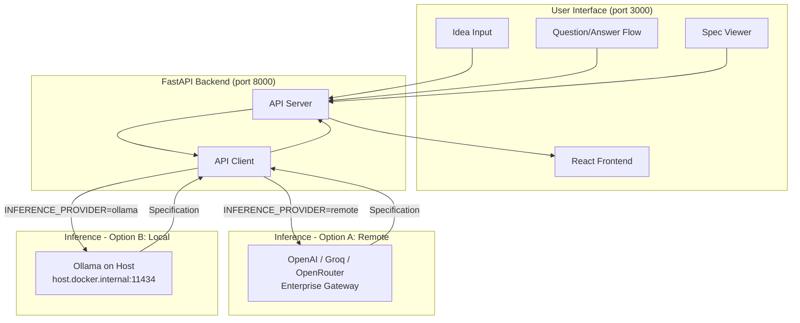

<p align="center">
  
</p>

# SpecForge — AI-Powered System Design Spec Generator

An AI-powered application that generates comprehensive system design specifications. Input your project idea, answer targeted questions, and receive a detailed architectural specification with diagrams, data models, API designs, and implementation plans — powered by any OpenAI-compatible LLM endpoint or locally running Ollama model.

---

## Table of Contents

- [SpecForge — AI-Powered System Design Spec Generator](#specforge--ai-powered-system-design-spec-generator)
  - [Table of Contents](#table-of-contents)
  - [Project Overview](#project-overview)
  - [How It Works](#how-it-works)
  - [Architecture](#architecture)
    - [Architecture Diagram](#architecture-diagram)
    - [Service Components](#service-components)
  - [Get Started](#get-started)
    - [Prerequisites](#prerequisites)
      - [Verify Installation](#verify-installation)
    - [Quick Start (Docker Deployment)](#quick-start-docker-deployment)
      - [1. Clone the Repository](#1-clone-the-repository)
      - [2. Configure the Environment](#2-configure-the-environment)
      - [3. Build and Start the Application](#3-build-and-start-the-application)
      - [4. Access the Application](#4-access-the-application)
      - [5. Verify Services](#5-verify-services)
      - [6. Stop the Application](#6-stop-the-application)
    - [Local Development Setup](#local-development-setup)
  - [Project Structure](#project-structure)
  - [Usage Guide](#usage-guide)
  - [Performance Tips](#performance-tips)
  - [Inference Benchmarks](#inference-benchmarks)
  - [Model Capabilities](#model-capabilities)
    - [GPT-4o](#gpt-4o)
    - [Llama 3.2 3B Instruct](#llama-32-3b-instruct)
    - [Comparison Summary](#comparison-summary)
  - [LLM Provider Configuration](#llm-provider-configuration)
    - [OpenAI](#openai)
    - [Groq](#groq)
    - [Ollama](#ollama)
    - [OpenRouter](#openrouter)
    - [Custom OpenAI-Compatible API](#custom-openai-compatible-api)
    - [Switching Providers](#switching-providers)
  - [Environment Variables](#environment-variables)
    - [Core LLM Configuration](#core-llm-configuration)
    - [Generation Parameters](#generation-parameters)
    - [Server Configuration](#server-configuration)
  - [Technology Stack](#technology-stack)
    - [Backend](#backend)
    - [Frontend](#frontend)
  - [Troubleshooting](#troubleshooting)
    - [Common Issues](#common-issues)
  - [License](#license)
  - [Disclaimer](#disclaimer)

---

## Project Overview

**SpecForge** demonstrates how large language models can be used to generate production-ready system design specifications. It supports multiple LLM providers and works with any OpenAI-compatible inference endpoint or a locally running Ollama instance.

This makes SpecForge suitable for:

- **Enterprise deployments** — connect to a GenAI Gateway or any managed LLM API
- **Air-gapped environments** — run fully offline with Ollama and a locally hosted model
- **Local experimentation** — quick setup with GPU-accelerated inference
- **Professional documentation** — generate specs that guide AI coding tools

---

## How It Works

1. The user enters a project idea in the browser
2. The React frontend sends the idea to the FastAPI backend
3. The backend generates 5 targeted clarifying questions using the configured LLM
4. The user answers the questions
5. The backend constructs a detailed prompt and streams the spec generation
6. The LLM returns a comprehensive 9-section specification with diagrams
7. The user can refine the spec through conversational feedback

All inference logic is abstracted behind a single `INFERENCE_PROVIDER` environment variable — switching between providers requires only a `.env` change and a container restart.

---

## Architecture

The application follows a modular two-service architecture with a React frontend and a FastAPI backend. The backend handles all inference orchestration and optional LLM observability. The inference layer is fully pluggable — any OpenAI-compatible remote endpoint or a locally running Ollama instance can be used without code changes.

### Architecture Diagram



### Service Components

| Service | Container | Host Port | Description |
|---------|-----------|-----------|-------------|
| `specforge-api` | `specforge-api` | `8000` | FastAPI backend — question generation, spec generation, refinement |
| `specforge-ui` | `specforge-ui` | `3000` | React frontend — served by dev server or Nginx in production |

> **Ollama is intentionally not a Docker service.** On macOS (Apple Silicon), running Ollama in Docker bypasses Metal GPU acceleration, resulting in CPU-only inference. Ollama must run natively on the host so the backend container can reach it via `host.docker.internal:11434`.

---

## Get Started

### Prerequisites

Before you begin, ensure you have the following installed and configured:

- **Docker and Docker Compose** (v2)
  - [Install Docker](https://docs.docker.com/get-docker/)
  - [Install Docker Compose](https://docs.docker.com/compose/install/)
- An inference endpoint — one of:
  - A remote OpenAI-compatible API key (OpenAI, Groq, OpenRouter, or enterprise gateway)
  - [Ollama](https://ollama.com/download) installed natively on the host machine

#### Verify Installation

```bash
docker --version
docker compose version
docker ps
```

### Quick Start (Docker Deployment)

#### 1. Clone the Repository

```bash
git clone https://github.com/cld2labs/SpecForge.git
cd SpecForge
```

#### 2. Configure the Environment

```bash
cp .env.example .env
```

Open `.env` and set `INFERENCE_PROVIDER` plus the corresponding variables for your chosen provider. See [LLM Provider Configuration](#llm-provider-configuration) for per-provider instructions.

#### 3. Build and Start the Application

```bash
# Standard (attached)
docker compose up --build

# Detached (background)
docker compose up -d --build
```

#### 4. Access the Application

Once containers are running:

- **Frontend UI**: [http://localhost:3000](http://localhost:3000)
- **Backend API**: [http://localhost:8000](http://localhost:8000)
- **API Docs (Swagger)**: [http://localhost:8000/docs](http://localhost:8000/docs)

#### 5. Verify Services

```bash
# Health check
curl http://localhost:8000/health

# View running containers
docker compose ps
```

**View logs:**

```bash
# All services
docker compose logs -f

# Backend only
docker compose logs -f specforge-api

# Frontend only
docker compose logs -f specforge-ui
```

#### 6. Stop the Application

```bash
docker compose down
```

### Local Development Setup

Run the backend and frontend directly on the host without Docker.

**Backend (Python / FastAPI)**

```bash
cd backend
python -m venv .venv
source .venv/bin/activate        # Windows: .venv\Scripts\activate
pip install -r requirements.txt
cp ../.env.example ../.env       # configure your .env at the repo root
uvicorn main:app --reload --port 8000
```

**Frontend (Node / Vite)**

```bash
cd frontend
npm install
npm run dev
```

The Vite dev server proxies `/api/` to `http://localhost:8000`. Open [http://localhost:5173](http://localhost:5173).

---

## Project Structure

```
SpecForge/
├── backend/                    # FastAPI backend
│   ├── config.py               # Environment-driven settings
│   ├── main.py                 # FastAPI app with lifespan
│   ├── models/
│   │   └── schemas.py          # Pydantic request/response models
│   ├── routers/
│   │   ├── questions.py        # Question generation endpoint
│   │   ├── generate.py         # Spec generation (streaming SSE)
│   │   └── refine.py           # Spec refinement endpoint
│   ├── services/
│   │   ├── api_client.py       # Unified LLM inference client
│   │   └── __init__.py
│   ├── prompts/
│   │   ├── generate_questions.txt
│   │   ├── generate_spec.txt
│   │   └── refine_spec.txt
│   ├── Dockerfile
│   └── requirements.txt
├── frontend/                   # React frontend
│   ├── src/
│   │   ├── App.jsx
│   │   ├── components/
│   │   └── main.jsx
│   ├── Dockerfile
│   └── package.json
├── .github/
│   └── workflows/
│       └── code-scans.yaml     # CI/CD security scans
├── docker-compose.yaml         # Service orchestration
├── .env.example                # Environment variable reference
├── README.md
├── CONTRIBUTING.md
├── SECURITY.md
├── DISCLAIMER.md
└── LICENSE.md
```

---

## Usage Guide

**Generate a specification:**

1. Open [http://localhost:3000](http://localhost:3000)
2. Enter your project idea (e.g., "A food delivery app like UberEats")
3. Click "Generate Questions"
4. Answer the 5 targeted questions
5. Click "Generate Specification"
6. Watch the spec stream in real-time
7. Download as markdown or refine with conversational feedback

**Refine your spec:**

1. Use the chat interface below the spec
2. Ask for changes (e.g., "Add a caching layer" or "Use PostgreSQL instead")
3. The AI updates the spec while maintaining structure

---

## Performance Tips

- **Use larger context windows for complex projects.** Models with 128K+ context (like GPT-4o) can handle more detailed requirements without truncation. For smaller models like Llama 3.2 3B (8K context), reduce `LLM_MAX_TOKENS` to leave room for prompts.
- **Lower `LLM_TEMPERATURE`** (e.g., `0.3–0.5`) for more consistent, structured specifications. Raise it slightly (e.g., `0.7–0.9`) for more creative architectural suggestions.
- **Provide detailed answers to clarifying questions.** The more context you provide, the more accurate and comprehensive the generated specification will be.
- **Use the refinement feature iteratively.** Start with a basic spec, then refine specific sections (e.g., "Add Redis caching layer", "Switch to PostgreSQL") rather than regenerating from scratch.
- **On Apple Silicon**, always run Ollama natively — never inside Docker. The MPS (Metal) GPU backend delivers significantly better throughput than CPU-only inference.
- **For enterprise deployments**, choose a model optimized for long-form technical writing. GPT-4o and Claude Sonnet 3.5 excel at structured documentation.

---

## Inference Benchmarks

The table below compares inference performance across different providers and models using a standardized SpecForge workload (3 runs: questions generation + spec generation with 1000 max output tokens).

| Provider       | Model                          | Deployment           | Context Window | Avg Input Tokens | Avg Output Tokens | Avg Tokens / Request | P50 Latency (ms) | P95 Latency (ms) | Throughput (req/s) | Hardware         |
| -------------- | ------------------------------ | -------------------- | -------------- | ---------------- | ----------------- | -------------------- | ---------------- | ---------------- | ------------------ | ---------------- |
| vLLM    | `meta-llama/Llama-3.2-3B-Instruct` | Local   | 16.4K           | 4,155            |  1,197               | 5,352                | 108,068           | 124,953           | 0.011              | Apple Silicon (Metal) (Macbook Pro M4)       |
| [Intel OPEA EI](https://github.com/opea-project/Enterprise-Inference)       | `meta-llama/Llama-3.2-3B-Instruct` | Enterprise (On-Prem)   | 8.1K           | 4,158            | 823               | 4,982                | 33,911           | 38,391           | 0.035              | CPU-only (Xeon)       |
| OpenAI (Cloud) | `gpt-4o`                       | API (Cloud)          | 128K           | 4,018            | 875               | 4,893                | 13,540           | 24,892           | 0.074              | N/A      |

> **Notes:**
>
> - All benchmarks use identical SpecForge workflows: idea input → 5 questions → spec generation with `LLM_MAX_TOKENS=1000`.
> - Token counts are actual values from API responses (not estimates).
> - GPT-4o delivers 2.5x faster P50 latency and 2.1x better throughput compared to Llama 3.2 3B on the tested infrastructure.
> - Llama 3.2 3B performance is limited by CPU-only inference on the test gateway. Local GPU inference would significantly improve these numbers.

---

## Model Capabilities

### GPT-4o

OpenAI's flagship multimodal model, optimized for speed and intelligence across text and vision tasks.

| Attribute                   | Details                                                                           |
| --------------------------- | --------------------------------------------------------------------------------- |
| **Parameters**              | Not publicly disclosed                                                            |
| **Architecture**            | Multimodal Transformer (text + image input, text output)                          |
| **Context Window**          | 128,000 tokens input / 16,384 tokens max output                                   |
| **Reasoning Mode**          | Standard inference with strong chain-of-thought reasoning                         |
| **Tool / Function Calling** | Supported; parallel function calling                                              |
| **Structured Output**       | JSON mode and strict JSON schema adherence supported                              |
| **Multilingual**            | Broad multilingual support (50+ languages)                                        |
| **Benchmarks**              | Strong performance on system design, architectural decision-making, and technical documentation |
| **Pricing**                 | $2.50 / 1M input tokens, $10.00 / 1M output tokens (as of 2024)                   |
| **Fine-Tuning**             | Supervised fine-tuning via OpenAI API                                             |
| **License**                 | Proprietary (OpenAI Terms of Use)                                                 |
| **Deployment**              | Cloud-only — OpenAI API or Azure OpenAI Service. No self-hosted option           |
| **Knowledge Cutoff**        | October 2023                                                                      |

### Llama 3.2 3B Instruct

Meta's small-scale open-weight instruction-tuned model, designed for edge and on-premises deployment.

| Attribute                   | Details                                                                                                             |
| --------------------------- | ------------------------------------------------------------------------------------------------------------------- |
| **Parameters**              | 3.21B total parameters                                                                                              |
| **Architecture**            | Transformer decoder with Grouped Query Attention (GQA)                                                              |
| **Context Window**          | 131,072 tokens (128K) native                                                                                        |
| **Reasoning Mode**          | Standard instruction-following (no explicit chain-of-thought mode)                                                  |
| **Tool / Function Calling** | Limited native support; can be prompted for structured output                                                       |
| **Structured Output**       | JSON formatting supported via prompting                                                                             |
| **Multilingual**            | Primarily English-focused with limited multilingual capabilities                                                    |
| **Benchmarks**              | MMLU: 63.4%, strong small-model performance for reasoning tasks                                                     |
| **Quantization Formats**    | GGUF, GPTQ, AWQ — runs on consumer hardware (4GB+ RAM)                                                              |
| **Inference Runtimes**      | Ollama, vLLM, llama.cpp, LMStudio, Transformers                                                                     |
| **Fine-Tuning**             | Full fine-tuning and LoRA adapters supported                                                                        |
| **License**                 | Llama 3.2 Community License (open for research and commercial use)                                                  |
| **Deployment**              | Local, on-prem, air-gapped, cloud — full data sovereignty                                                           |

### Comparison Summary

| Capability                      | GPT-4o                           | Llama 3.2 3B Instruct            |
| ------------------------------- | -------------------------------- | -------------------------------- |
| System design specifications    | Excellent                        | Good                             |
| Architectural diagrams          | Excellent                        | Good (requires careful prompting)|
| Technical documentation         | Excellent                        | Good                             |
| Function / tool calling         | Native support                   | Prompt-based                     |
| JSON structured output          | Native with schema validation    | Prompt-based                     |
| On-prem / air-gapped deployment | No                               | Yes                              |
| Data sovereignty                | No (cloud API)                   | Full (weights run locally)       |
| Open weights                    | No (proprietary)                 | Yes (Llama 3.2 License)          |
| Custom fine-tuning              | API-based only                   | Full fine-tuning + LoRA          |
| Edge device deployment          | N/A                              | Yes (quantized variants)         |
| Multimodal (image input)        | Yes                              | No                               |
| Native context window           | 128K                             | 128K                             |

> Both models can generate system design specifications, though GPT-4o produces more comprehensive and detailed output with better architectural reasoning. Llama 3.2 3B excels in air-gapped environments, cost-sensitive deployments, and scenarios requiring data sovereignty.

---

## LLM Provider Configuration

All providers are configured via the `.env` file. Set `INFERENCE_PROVIDER=remote` for any cloud or API-based provider, and `INFERENCE_PROVIDER=ollama` for local inference.

### OpenAI

```bash
INFERENCE_PROVIDER=remote
INFERENCE_API_ENDPOINT=https://api.openai.com
INFERENCE_API_TOKEN=sk-...
INFERENCE_MODEL_NAME=gpt-4o
```

Recommended models: `gpt-4o`, `gpt-4o-mini`, `gpt-4-turbo`.

### Groq

Groq provides OpenAI-compatible endpoints with extremely fast inference (LPU hardware).

```bash
INFERENCE_PROVIDER=remote
INFERENCE_API_ENDPOINT=https://api.groq.com/openai
INFERENCE_API_TOKEN=gsk_...
INFERENCE_MODEL_NAME=llama3-70b-8192
```

Recommended models: `llama3-70b-8192`, `mixtral-8x7b-32768`, `llama-3.1-8b-instant`.

### Ollama

Runs inference locally on the host machine with full GPU acceleration.

1. Install Ollama: [https://ollama.com/download](https://ollama.com/download)
2. Pull a model:
   ```bash
   # Production — best spec generation quality (~20 GB)
   ollama pull codellama:34b

   # Testing / SLM benchmarking (~4 GB, fast)
   ollama pull codellama:7b

   # Other strong code models
   ollama pull deepseek-coder:6.7b
   ollama pull qwen2.5-coder:7b
   ollama pull codellama:13b
   ```
3. Confirm Ollama is running:
   ```bash
   curl http://localhost:11434/api/tags
   ```
4. Configure `.env`:
   ```bash
   INFERENCE_PROVIDER=ollama
   INFERENCE_API_ENDPOINT=http://host.docker.internal:11434
   INFERENCE_MODEL_NAME=codellama:34b
   # INFERENCE_API_TOKEN is not required for Ollama
   ```

### OpenRouter

OpenRouter provides a unified API across hundreds of models from different providers.

```bash
INFERENCE_PROVIDER=remote
INFERENCE_API_ENDPOINT=https://openrouter.ai/api
INFERENCE_API_TOKEN=sk-or-...
INFERENCE_MODEL_NAME=anthropic/claude-3.5-sonnet
```

Recommended models: `anthropic/claude-3.5-sonnet`, `meta-llama/llama-3.1-70b-instruct`, `deepseek/deepseek-coder`.

### Custom OpenAI-Compatible API

Any enterprise gateway that exposes an OpenAI-compatible `/v1/completions` or `/v1/chat/completions` endpoint works without code changes.

**GenAI Gateway (LiteLLM-backed):**

```bash
INFERENCE_PROVIDER=remote
INFERENCE_API_ENDPOINT=https://genai-gateway.example.com
INFERENCE_API_TOKEN=your-litellm-master-key
INFERENCE_MODEL_NAME=codellama/CodeLlama-34b-Instruct-hf
```

If the endpoint uses a private domain mapped in `/etc/hosts`, also set:

```bash
LOCAL_URL_ENDPOINT=your-private-domain.internal
```

### Switching Providers

1. Edit `.env` with the new provider's values.
2. Restart the backend container:
   ```bash
   docker compose restart specforge-api
   ```

No rebuild is needed — all settings are injected at runtime via environment variables.

---

## Environment Variables

All variables are defined in `.env` (copied from `.env.example`). The backend reads them at startup via `python-dotenv`.

### Core LLM Configuration

| Variable | Description | Default | Type |
|----------|-------------|---------|------|
| `INFERENCE_PROVIDER` | `remote` for any OpenAI-compatible API; `ollama` for local inference | `remote` | string |
| `INFERENCE_API_ENDPOINT` | Base URL of the inference service (no `/v1` suffix) | — | string |
| `INFERENCE_API_TOKEN` | Bearer token / API key. Not required for Ollama | — | string |
| `INFERENCE_MODEL_NAME` | Model identifier passed to the API | `gpt-4o` | string |

### Generation Parameters

| Variable | Description | Default | Type |
|----------|-------------|---------|------|
| `LLM_TEMPERATURE` | Sampling temperature. Lower = more deterministic output (0.0–2.0) | `0.7` | float |
| `LLM_MAX_TOKENS` | Maximum tokens in the generated output | `8000` | integer |

### Server Configuration

| Variable | Description | Default | Type |
|----------|-------------|---------|------|
| `BACKEND_PORT` | Port the FastAPI server listens on | `8000` | integer |
| `CORS_ALLOW_ORIGINS` | Allowed CORS origins (comma-separated or `*`). Restrict in production | `["*"]` | string |
| `LOCAL_URL_ENDPOINT` | Private domain in `/etc/hosts` the container must resolve. Leave as `not-needed` if not applicable | `not-needed` | string |
| `VERIFY_SSL` | Set `false` only for environments with self-signed certificates | `true` | boolean |

---

## Technology Stack

### Backend

- **Framework**: FastAPI (Python 3.11+) with Uvicorn ASGI server
- **LLM Integration**: `openai` Python SDK — works with any OpenAI-compatible endpoint (remote or Ollama)
- **Local Inference**: Ollama — runs natively on host with full Metal (MPS) or CUDA GPU acceleration
- **Config Management**: `python-dotenv` for environment variable injection at startup
- **Data Validation**: Pydantic v2 for request/response schema enforcement

### Frontend

- **Framework**: React 18 with Vite (fast HMR and production bundler)
- **Styling**: Tailwind CSS v3 with custom dark mode design
- **UI Features**: Real-time streaming, markdown rendering, conversational refinement, dark mode

---

## Troubleshooting

For detailed troubleshooting, see [TROUBLESHOOTING.md](./TROUBLESHOOTING.md).

### Common Issues

**Issue: Backend returns 503 or 500 on generate**

```bash
# Check backend logs for error details
docker compose logs specforge-api

# Verify the inference endpoint and token are set correctly
grep INFERENCE .env
```

- Confirm `INFERENCE_API_ENDPOINT` is reachable from your machine.
- Verify `INFERENCE_API_TOKEN` is valid and has the correct permissions.

**Issue: Ollama connection refused**

```bash
# Confirm Ollama is running on the host
curl http://localhost:11434/api/tags

# If not running, start it
ollama serve
```

**Issue: Ollama is slow / appears to be CPU-only**

- Ensure Ollama is running natively on the host, **not** inside Docker.
- On macOS, verify the Ollama app is using MPS in Activity Monitor (GPU History).
- See the [Ollama](#ollama) section for correct setup.

**Issue: SSL certificate errors**

```bash
# In .env
VERIFY_SSL=false

# Restart the backend
docker compose restart specforge-api
```

**Issue: Frontend cannot connect to API**

```bash
# Verify both containers are running
docker compose ps

# Check CORS settings
grep CORS .env
```

Ensure `CORS_ALLOW_ORIGINS` includes the frontend origin (e.g., `http://localhost:3000`).

**Issue: Private domain not resolving inside container**

Set `LOCAL_URL_ENDPOINT=your-private-domain.internal` in `.env` — this adds the host-gateway mapping for the container.

---

## License

This project is licensed under our [LICENSE](./LICENSE.md) file for details.

---

## Disclaimer

**SpecForge** is provided as-is for demonstration and educational purposes. While we strive for accuracy:

- AI-generated specifications should be reviewed by qualified engineers before use in production systems
- Do not rely solely on AI-generated specifications without testing and validation
- Do not submit confidential or proprietary information to third-party API providers without reviewing their data handling policies
- The quality of generated specifications depends on the underlying model and may vary

For full disclaimer details, see [DISCLAIMER.md](./DISCLAIMER.md).

